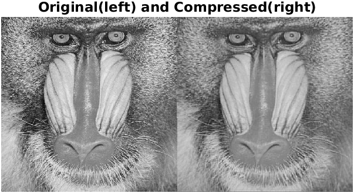

 
# Image compressor
 
 
The project aims to compress images using Discrete Cosine Transformcorona times 

# Working 
DCT has the property that most of the visually significant information about the image is concentrated in just a few coefficient of the DCT. This property is known as Energy compaction property. So the unnecessary coefficients can be discarded or scaled without making much difference.

# Result
Code uses tranformation matrix approach to calculate Discrete Cosine Transform. The code was able to achieve about 70% compression on grayscale images without making much difference to the image.

# Tech Stack 
This project was built using 
- MATLAB
- Image processing toolbox for MATLAB

   

